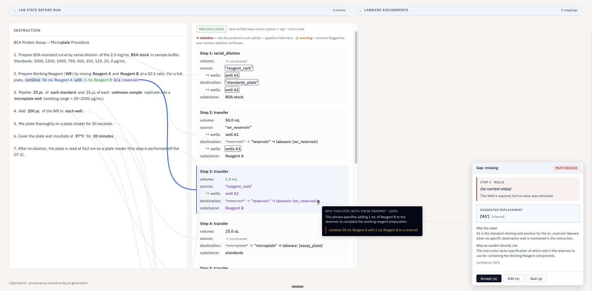

# nl2protocol

Turn a natural-language lab protocol into a runnable Opentrons OT-2 script — with every value cited back to the instruction, every gap surfaced before code is generated, and the final script validated by the Opentrons simulator.

<!-- HERO: live-mode UI mid-run — 3-column layout (Instruction · Protocol Steps · Generated Python), with cite-hue highlighting and step→code arrows visible. `website/static/demo-screenshot.png` is the current asset (May 17), but the UI has changed since — re-capture before publishing. -->


<!-- BENCHMARK: one-line headline once `python evals/run.py --all` is hand-graded against the 20 cases in `evals/`. Example shape: "16/20 cases produce a simulator-clean script with intent preserved (graded 2026-06)." -->
> **Benchmark:** _TBD — 20-case prose-graded suite in [`evals/`](evals/), runner [`evals/run.py`](evals/run.py); graded artifacts land in `evals/runs/`._

<!-- LIVE DEMO: deploy is configured on Fly.io as `nl2protocol-aryan` (see fly.toml). Machines auto-stop when idle, so cold requests wait ~1s. Confirm the app is awake and the WebSocket handshake works before linking publicly. -->
- **Live demo:** [`nl2protocol-aryan.fly.dev`](https://nl2protocol-aryan.fly.dev) _(verify uptime before publishing)_
- **60-second walkthrough:** _coming soon — type a real prompt → spec with citations → gap modal → generated Opentrons script → simulator green._

---

## What's actually in here

A 7-stage pipeline (`nl2protocol/pipeline.py`, `PIPELINE_STAGES`) the user sees as: **Validating input → Extracting protocol → Resolving labware → Confirming with you → Resolving gaps → Checking hardware → Building & simulating.** Two stages use an LLM (Sonnet for extraction and labware resolution; Haiku for the per-suggestion reviewer and targeted spot-fill); the rest are deterministic Python.

Five concrete pieces it's built out of:

- **Per-value Provenance, source-typed.** Every quantity in the spec is wrapped in `ProvenancedVolume`, `ProvenancedDuration`, `ProvenancedTemperature`, or `ProvenancedString`, each carrying a `Provenance{source, cited_text, positive_reasoning, why_not_in_instruction, review_status, reviewer_objection, confidence, prior_revisions}` object. `source ∈ {"instruction", "domain_default", "inferred"}`; `cited_text` is a list of verbatim substrings (multi-cite). The verifier in `extraction/provenance_checking.py` dispatches on `source` — `instruction` claims are checked against the user's text and blocked on fabrication; the rest are routed to user confirmation. `review_status` records the lifecycle (`original` → `reviewed_agree` / `reviewed_disagree` → `user_confirmed` / `user_edited` / `user_accepted_suggestion` / `user_skipped` / `user_overrode_fabrication`), and every edit pushes the old state onto `prior_revisions` (ADR-0014). [ADR-0002](docs/adr/0002-provenanced-protocol-spec.md).

- **Typed IR with a deterministic boundary.** Extraction emits a `ProtocolSpec` / `CompleteProtocolSpec` in *science language* — `ExtractedStep`s over a 17-value `ActionType` enum (`transfer`, `distribute`, `consolidate`, `serial_dilution`, `mix`, `delay`, `pause`, `aspirate`, `dispense`, `blow_out`, `touch_tip`, `set_temperature`, `wait_for_temperature`, `engage_magnets`, `disengage_magnets`, `deactivate`, `comment`). A pure-Python `spec_to_schema()` (`extraction/schema_builder.py`, 936 lines) converts it to a `ProtocolSchema` (Labware, Pipette, Module, Command discriminated-union) — deterministic pipette assignment by range check, labware lookup by config label, well-range expansion, command emission. No LLM sits between the user's `100uL` and the generated `transfer(100, ...)`. [ADR-0007](docs/adr/0007-schema-enforcement-layers.md).

- **One gap-resolution loop for every kind of incompleteness.** The orchestrator in `gap_resolution/orchestrator.py` runs `detect → topo-sort → suggest → review → present → apply → re-detect`, capped at `MAX_ITERATIONS`. Six **Detectors** find gaps: `MissingFieldsDetector`, `ProvenanceWarningDetector`, `InitialContentsVolumeDetector`, `ConstraintViolationDetector`, `LabwareAmbiguityDetector`, `NamespaceSplitDetector`. Seven **Suggesters** propose fills, deterministic first, LLM last: `ConfigLookupSuggester`, `CarryoverSuggester`, `WellCapacitySuggester`, `RegexFromNoteSuggester`, `WellRangeClipSuggester`, `LLMSpotSuggester` (scoped Haiku call, one field at a time), `IndependentReviewSuggester` (Haiku reviewer that can flip a suggestion to `reviewed_disagree`). Every suggestion is stamped with provenance and replays through the loop until no gaps remain. Replaces six legacy detect/fill/refine paths with one. [ADR-0008](docs/adr/0008-unified-gap-resolution.md).

- **Deterministic hardware constraint checker.** `assert_physical_constraints()` in `validation/constraints.py` (1175 lines) checks: pipette capacity vs. step volume, pipette minimum, well-position validity on the chosen labware, labware-label resolvability, module availability, labware-vs-module loadability, tip-budget sufficiency, well-capacity-vs-operation, and deck-slot conflicts. Violations become `Gap`s the orchestrator can route — they aren't auto-rewritten.

- **Opentrons codegen + real simulator.** A Jinja template renders `ProtocolSchema` to Opentrons Python (same input → same script). The script then runs through `opentrons.simulate.simulate()` inside `pipeline.simulate_script()` to catch runtime-shaped errors the static checks can't see (invalid wells for a labware def, tip-rack exhaustion, deck conflicts, deprecated API patterns). A simulator failure blocks the run.

Two surfaces sit on this pipeline:

- **CLI** — `nl2protocol -i instruction.txt -c lab_config.json`, plus `--html-report` for a self-contained artifact, `--confirmation-threshold` to tune what auto-accepts, `--full-confirmation` to force every value through user review, `--robot` to upload to a connected OT-2.
- **Live browser UI** — `nl2protocol --serve` boots a FastAPI app (`server/app.py`); `POST /start` kicks the pipeline into a worker thread and `WebSocket /events` streams stage events back. The 3-column page (Instruction · Protocol Steps · Generated Python, `reporting_templates/report.html.jinja`) renders per-field revision chains inline, encodes citations on two axes (color = cite hue, outline = source kind: `prov-instruction` / `prov-domain_default` / `prov-inferred`), and draws hover arrows from each step block to the matching Python lines. Bulk confirmations land as one panel each: `HTMLAssignmentsHandler` (labware mapping table), `HTMLNamespaceSplitHandler` (radio split), `HTMLInitialContentsHandler` (volume entry per well), `HTMLBinaryConfirmHandler` (yes/no). Thread-bridged synchronously — no `async` in the pipeline ([ADR-0013](docs/adr/0013-live-mode-server.md)).

---

## Run it locally

Requires Python 3.10+ and an [Anthropic API key](https://console.anthropic.com/).

```bash
pip install .                                       # 1. install
nl2protocol --setup                                 # 2. interactive: writes .env with ANTHROPIC_API_KEY
nl2protocol --serve                                 # 3. opens http://127.0.0.1:8000 in your browser
```

Prefer the CLI?

```bash
nl2protocol -i test_cases/examples/simple_transfer/instruction.txt \
            -c test_cases/examples/simple_transfer/config.json
```

Thirteen worked examples in [`test_cases/examples/`](test_cases/examples/) (simple_transfer, distribute, serial_dilution, pcr_mastermix, bradford_assay, qpcr_standard_curve, elisa_sample_addition, magnetic_bead_cleanup, bacterial_transformation, plasmid_miniprep, cell_seeding, cell_viability_assay, western_blot_prep); twelve designed-to-fail cases in [`test_cases/failure_modes/`](test_cases/failure_modes/). Dockerfile + `fly.toml` deploy the live-mode surface on Fly.io.

---

## Honest limitations

- **Non-pipetting hardware is out of scope.** Centrifuges, plate readers, gel boxes, microscopes — not on the OT-2 deck. Stage 1 classifies them as `INVALID` and halts.
- **LLM extraction is non-deterministic.** Same instruction can produce different specs across runs. The deterministic stages (provenance check, constraint check, simulator) are what guarantee any individual run is sound — not LLM consistency.
- **Domain-knowledge claims aren't auto-verified.** Values the LLM tags `domain_default` (e.g., "Bradford incubation is 5 min") route to user confirmation — there's no external knowledge base in the loop.
- **Provenance is LLM-generated.** It's structured-verifiable for the subset of claims grounded in the instruction text, structured-triage for the rest. Not an external check.
- **`LLMSpotSuggester` can still cite wrongly.** Targeted spot-fills are reviewed by `IndependentReviewSuggester` (Haiku) before they reach the user, but the reviewer is the same model family. The pipeline mitigates rather than solves this.
- **No cross-protocol state.** Each run is independent; tip use and well state from a prior run are not remembered.

Full per-stage breakdown of what each stage promises and what it doesn't: [`docs/PIPELINE.md`](docs/PIPELINE.md). Gap lifecycle in [`docs/GAP_LIFECYCLE.md`](docs/GAP_LIFECYCLE.md).

---

## Pinned design decisions

Fifteen ADRs in [`docs/adr/`](docs/adr/); three are load-bearing:

- [**ADR-0002 — Provenanced ProtocolSpec**](docs/adr/0002-provenanced-protocol-spec.md). *Naive:* validate LLM output for shape only. *Constraint:* shape-valid output can still cite values the user never wrote, so the schema has to carry per-value citations the verifier can dispatch on.
- [**ADR-0007 — Schema enforcement layers**](docs/adr/0007-schema-enforcement-layers.md). *Naive:* a single LLM call produces the final hardware schema, with retry on validation. *Constraint:* under retry, the LLM rewrites user-specified volumes to make schemas pass. Fix is a deterministic boundary between science-language and hardware-language.
- [**ADR-0008 — Unified gap resolution**](docs/adr/0008-unified-gap-resolution.md). *Naive:* each kind of incompleteness gets its own ad-hoc path. *Constraint:* six paths means six UXs and no way to add a new gap kind without re-deriving the plumbing. Updated by [ADR-0014](docs/adr/0014-revision-history-and-apply-path-overhaul.md) (per-field revision history + apply-path overhaul).

---

## Evaluation

<!-- EVAL TABLE: replace with a small table once `python evals/run.py --all` artifacts are graded.
     Shape: | Case | Simulator | Intent preserved | Notes |.
     Keep to the most informative ~8 rows; link out to evals/runs/. -->

| Case | Simulator | Intent preserved | Notes |
|------|-----------|------------------|-------|
| _TBD_ | _TBD_ | _TBD_ | `python evals/run.py --all` |

20 cases (`01_lotterhos_magbead` … `20_out_of_scope_centrifuge`) drawn from Lotterhos lab protocols, OpenWetWare, the Opentrons docs, and designed-to-fail edge cases. Each case has `instruction.txt`, `config.json`, and a prose `expected.md`. The runner writes `console.txt`, `prompts.txt` (every auto-accepted prompt logged so a passing run isn't a rubber-stamped one), and `result.json` per case. Grading is intentionally human — LLM outputs vary, ground truth is prose, the human is the grader.

---

## Tests

```bash
pytest tests/ -v                                          # 826 tests across 28 files: contract, property, integration
ANTHROPIC_API_KEY=... pytest tests/ -v                    # also LLM-dependent integration tests
mutmut run                                                # mutation testing of validation/constraints.py
```

Contract tests (one-per-clause unit tests against prescriptive function docstrings) + Hypothesis property tests under `tests/property/` + boundary tests + mocked-LLM integration tests under `tests/integration/`. Mutation testing configured against `validation/constraints.py`. Strategy in [`docs/TESTING.md`](docs/TESTING.md).

---

## Stack

Python 3.10+ · [Pydantic v2](https://docs.pydantic.dev/) (typed IR, field- and model-validator enforcement layers) · [Anthropic SDK](https://github.com/anthropics/anthropic-sdk-python) (Sonnet for extraction + labware resolution; Haiku for reviewer + spot-fill) · [Opentrons API](https://docs.opentrons.com/) (protocol simulator) · FastAPI + WebSocket (live mode) · Jinja2 (HTML report) · Fly.io (hosted demo)

MIT.
