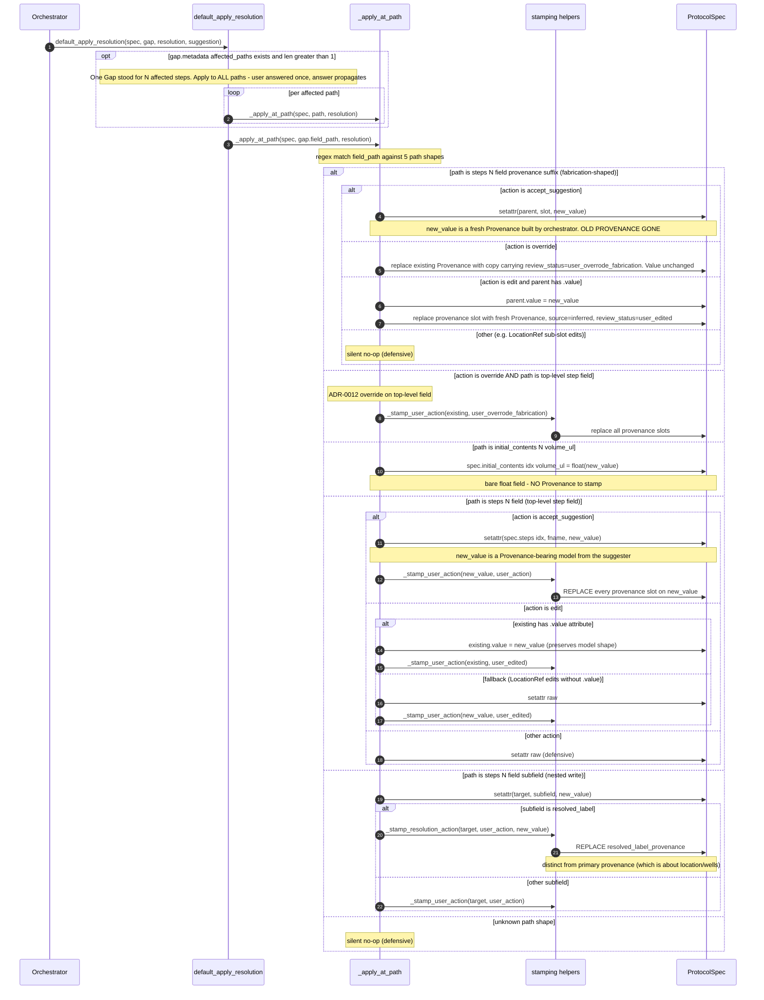
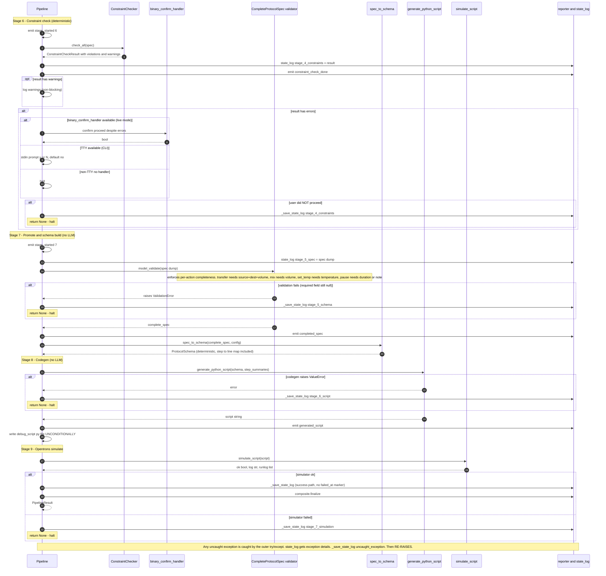

# Gap lifecycle (stages 5-7, function-level)

Exploratory doc. Goal: understand exactly what happens to a Gap from detection to applied resolution, with specific focus on three questions that don't get answered by the architecture doc:

1. **How are wells/well-ranges actually handled?** What's the data shape? Where does the provenance attach?
2. **What happens to provenance across iterations?** When iteration 2 fixes something iteration 1 touched, is the old provenance preserved anywhere, or overwritten and gone?
3. **Is the "value in citation" check broken in some sense?** When does it work, when does it fail?

Reads stages 5-7 of `PIPELINE.md` at the code-line level. Plain-language summaries paired with code snippets. Not a polished diagram doc; a "let's understand this together" doc.

---

## Part 1 — The shapes

Before the sequence, the data types involved. Understanding these makes the rest legible.

### `Provenance` (`models/spec.py:24`)

Pydantic model with these fields:

```python
source: Literal["instruction", "domain_default", "inferred"]
cited_text: Optional[List[str]]              # required iff source == "instruction"
positive_reasoning: Optional[str]            # required iff source != "instruction"
why_not_in_instruction: Optional[str]
review_status: Literal[                       # 8 states across the review lifecycle
    "original",
    "reviewed_agree", "reviewed_disagree",
    "user_confirmed", "user_edited",
    "user_accepted_suggestion", "user_skipped",
    "user_overrode_fabrication",
]
reviewer_objection: Optional[str]            # required iff status == "reviewed_disagree"
confidence: float                            # 0.0–1.0
```

**Key facts:**
- A Provenance is **a single object** — it does not carry history. There's no `previous_states: List[...]` field. Whoever writes to a provenance slot REPLACES the object.
- `cited_text` is a `List[str]` (after the `_normalize_cited_text` validator on line 134 wraps bare strings into one-element lists). The list shape exists specifically to support spread citations.
- `review_status` is a single value — it tells you what the *last* action on this Provenance was. It doesn't tell you what happened before that action.

### `LocationRef` (`models/spec.py:432`)

Where the wells live. Three slots for the well-shape:

```python
description: str                              # user's wording: "tube rack"
well: Optional[str]                           # single well: "A1"
wells: Optional[List[str]]                    # multi-well: ["A1", "A2", "A3"]
well_range: Optional[str]                     # range expression: "A1:H12"
resolved_label: Optional[str]                 # config labware key, filled by resolver
```

And **three** provenance slots:

```python
description_provenance: Provenance            # how the description was determined
wells_provenance: Optional[Provenance]        # how the wells were determined
resolved_label_provenance: Optional[Provenance]  # how the config label was picked
```

**Key fact:** `wells_provenance` is ONE Provenance object for the ENTIRE wells set. There is no per-well provenance. If `wells = [A1, A2, A3, A4]`, there's a single `wells_provenance` that's supposed to ground all four.

This shape is the source of half the friction below. We'll come back to it.

### `Gap`, `Suggestion`, `Resolution` (`gap_resolution/types.py`)

Plain dataclasses. Carry just enough to flow through detect → suggest → review → apply:

- **`Gap`** — `id`, `step_order`, `field_path`, `kind` (missing/fabricated/etc.), `current_value`, `description`, `severity`, `metadata` (mutable dict).
- **`Suggestion`** — `value`, `provenance_source` (deterministic/inferred/domain_default), `positive_reasoning`, `why_not_in_instruction`, `confidence`.
- **`Resolution`** — `action` (accept_suggestion/edit/skip/abort/override), `new_value`, `user_action_provenance` (one of the 8 user_* review_status values).

None of these are mutable Pydantic models; they're frozen dataclasses. Once constructed, the only mutation is `gap.metadata[key] = ...` (the metadata dict is shared mutable state).

---

## Part 2 — A single Gap's lifecycle, function by function

Let's walk one fabrication gap from birth to death.

**Setup:** instruction says "Transfer 50uL from A1 of the rack to B1 of the plate." Extractor produces a step with `source.wells = ["A1"]` and `source.wells_provenance.cited_text = ["A1 of the rack"]`. All fine. Now imagine the user re-runs with a less-careful instruction: "Add Plasmid A to tube 1, Plasmid B to tube 2, Plasmid C to tube 3." LLM extracts `source.wells = ["A1", "B1", "C1"]` (made up the well numbers from "tube N"), with `source.wells_provenance.cited_text = ["Plasmid A to tube 1"]` (just one cite, the first bullet).

### Step 1 — Detection (`detectors.py:206`)

`Orchestrator.run` calls `detect_all(spec, context, detectors)` (`orchestrator.py:206`). For our gap, the relevant detector is `ProvenanceWarningDetector` (`detectors.py:180`):

```python
def detect(self, spec, context: dict) -> List[Gap]:
    warnings = self._extractor.verify_provenance_claims(spec, instruction, config)
    gaps: List[Gap] = []
    for w in warnings:
        ...
        gaps.append(Gap(id=_warning_id(w), ...))
    return gaps
```

It calls `extractor.verify_provenance_claims` (back into `extraction/extractor.py`), which calls `_verify_claimed_instruction_provenance` (`extractor.py:285`). That function walks every step's fields. For wells:

```python
# extractor.py:366-373
wells = list(ref.wells or ([ref.well] if ref.well else []))
for w in wells:
    # Every well on a ref shares one wells_provenance, so all
    # well-fabrication warnings point at the SAME slot. Gap
    # dedup by id collapses them into one Gap.
    check(step.order, f"{role} well",
          f"steps[{step_idx}].{role}.wells_provenance",
          w, ref.wells_provenance)
```

Three calls to `check`, one per well. Each call gets the same `field_path` (`steps[0].source.wells_provenance`) and the same provenance object — only `value` differs.

Inside `check` (`extractor.py:305`), for each well:

```python
# extractor.py:336
if not any(self._value_in_quote(value, q) for q in quotes):
    warnings.append(self._warn(..., field_path=field_path))
```

Where `quotes = prov.cited_text = ["Plasmid A to tube 1"]` (the single cite). The check asks: is "A1" a substring of "Plasmid A to tube 1"? No. Warning fires. Is "B1" a substring? No. Warning fires. Is "C1" a substring? No. Warning fires.

**Three warnings, all with the SAME field_path and SAME role/field label.**

### Step 2 — Gap construction with deduplication

Back in `detectors.py:222`, each warning becomes a Gap with `id = _warning_id(w)`:

```python
# detectors.py:173
def _warning_id(warning: dict) -> str:
    step = warning.get("step", 0)
    field = (warning.get("field") or "unknown").replace(" ", "_")
    severity = warning.get("severity", "unknown")
    return f"step{step}.{field}.{severity}"
```

All three warnings have `field = "source well"`, `step = 1`, `severity = "fabrication"`. So all three get the same id: `step1.source_well.fabrication`. **They're three logical complaints but collapse into one Gap.** This is by design (see the comment at `extractor.py:368-370`).

But the Gap's `current_value` is set from `w.get("value")` for **the last warning** in the loop:

```python
# detectors.py:226
current_value=w.get("value"),
```

So `current_value` is whichever well's warning came last — `"C1"` in our example. The user sees a modal saying "Current: C1" even though the actual field state is `["A1", "B1", "C1"]`. **This is the "Current: B2" bug** in our earlier screenshot.

### Step 3 — Topological sort (`orchestrator.py:82`)

`Orchestrator.run` sorts the gaps so dependent fields get upstream values first. Our gap (on `steps[0].source.wells_provenance`) ends with `.source` somewhere in the path → priority 1 (mid-priority).

### Step 4 — Suggestion (`orchestrator.py:251`)

```python
for gap in gaps:
    suggestions[gap.id] = self._first_suggestion(gap, spec, context)
```

Walks the suggester registry in order, returns first non-None:
- `ConfigLookupSuggester` — gap is on wells_provenance, not on a missing field → None.
- `CarryoverSuggester` — not a carryover-able shape → None.
- `WellCapacitySuggester` — not a volume gap → None.
- `RegexFromNoteSuggester` — no note text → None.
- `WellRangeClipSuggester` — gap kind is `fabricated`, not `constraint_violation` → None.
- `LabwareSuggester` — not an ambiguous gap → None.
- `LLMSpotSuggester` — **fires.** Makes one Sonnet call: "Here's a fabrication on wells_provenance; the cited_text doesn't ground the value `'C1'`. Propose a fix." Returns a `Suggestion` with `provenance_source = "inferred"`, `positive_reasoning = "..."`, `why_not_in_instruction = "..."`, `confidence = 0.85ish`.

### Step 5 — Review (`orchestrator.py:268`)

`IndependentReviewSuggester` runs a Haiku call evaluating the suggestion's two reasoning claims:

```python
reviews = self._reviewer.review(spec, context)
if hasattr(spec, "steps"):
    stamp_reviewer_verdicts(spec, reviews)
```

`stamp_reviewer_verdicts` walks the spec (`orchestrator.py:459`). For LocationRef wells_provenance, lines 527-540:

```python
for role in ("source", "destination"):
    ref = getattr(step, role, None)
    review = reviews.get(f"steps[{step_idx}].{role}")
    if review is None:
        continue
    for prov_attr in ("description_provenance", "wells_provenance"):
        prov = getattr(ref, prov_attr, None)
        if prov is None:
            continue
        setattr(ref, prov_attr, Provenance.model_validate({
            **prov.model_dump(), **_verdict_updates(review),
        }))
```

**Key behavior here:** the reviewer's verdict on `steps[N].source` gets stamped onto BOTH `description_provenance` AND `wells_provenance`, even though the original review was about one logical claim. This is what CodeRabbit flagged at `suggesters.py:807` — independent provenance slots get the same verdict because the reviewer only sees one claim per LocationRef.

Also: **the old Provenance object is replaced.** `setattr(ref, prov_attr, Provenance.model_validate({**prov.model_dump(), ...updates}))` constructs a new object and overwrites. The original review_status (probably `"original"`) is gone after this line.

### Step 6 — Auto-accept gate (`orchestrator.py:277`)

```python
def _is_auto_acceptable(self, gap, suggestion, review) -> bool:
    if suggestion is None: return False
    if gap.kind in ALWAYS_CONFIRM_KINDS: return False  # fabricated IS in this set
    if suggestion.confidence < self._threshold: return False
    if review is not None and not (review.confirms_positive and review.confirms_negative):
        return False
    return True
```

`fabricated` is in `ALWAYS_CONFIRM_KINDS` (`orchestrator.py:53`). Our gap never auto-accepts. **Every fabrication goes to the user.**

### Step 7 — User modal (`orchestrator.py:314`)

```python
resolution = self._handler.present(gap, suggestion)
```

User sees a modal showing the gap, the suggestion, the buttons (Accept / Edit / Override / Skip / Abort). Whatever they click becomes a `Resolution`.

If they hit Accept, the orchestrator does this special-case transform (`orchestrator.py:341`):

```python
if (resolution.action == "accept_suggestion"
        and gap.kind == "fabricated"
        and suggestion is not None):
    from nl2protocol.models.spec import Provenance
    resolution = Resolution(
        action="accept_suggestion",
        new_value=Provenance(
            source="inferred",
            positive_reasoning=suggestion.positive_reasoning,
            why_not_in_instruction=suggestion.why_not_in_instruction,
            confidence=suggestion.confidence,         # ← overwrites
            review_status="user_accepted_suggestion",
        ),
        user_action_provenance="user_accepted_suggestion",
    )
```

This is the "for fabrication gaps, accept restates the provenance as inferred" path the architecture doc describes. **And this is where `confidence` gets overwritten** with the suggester's confidence — the user didn't endorse that confidence number; the code just attached it.

### Step 8 — Apply (`orchestrator.py:357` → `default_apply_resolution` at `:748` → `_apply_at_path` at `:802`)

`_apply_at_path` regex-matches the field_path. For fabrication-shaped paths (`steps[N].<field>.<...provenance>`):

```python
# orchestrator.py:826-838
m = re.match(r"steps\[(\d+)\]\.(\w+)\.(\w*provenance)$", path)
if m:
    idx, fname, slot = int(m.group(1)), m.group(2), m.group(3)
    parent = getattr(spec.steps[idx], fname, None)
    if resolution.action == "accept_suggestion":
        setattr(parent, slot, new_value)         # ← the entire provenance is replaced
        return
```

`setattr(parent, slot, new_value)` — the WHOLE `wells_provenance` object is replaced with the new one the orchestrator built. **The original Provenance is gone.** No backup, no history, no `previous_provenance` list. Just gone.

### Step 9 — Re-detect for iteration 2 (`orchestrator.py:206` again)

Loop restarts. `detect_all` runs again. The verifier walks the spec again. The `wells_provenance` it sees now has `source = "inferred"` (not "instruction"), so the `check` function short-circuits at line 307:

```python
if not prov or prov.source != "instruction":
    return
```

Inferred provenance is not subject to the cited_text check — there's nothing to verify. The fabrication gap doesn't re-fire. The iteration ends with zero gaps. Loop converges.

### What's recorded for audit

`state_log["stage_3_gap_resolver"]["iterations"]` (set up at `pipeline.py:1352-1363`) is a list of `IterationResult` records, each with `records: List[GapResolutionRecord]`:

```python
# orchestrator.py:101
@dataclass
class GapResolutionRecord:
    gap: Gap                          # snapshot at detect time
    suggestion: Optional[Suggestion]
    review: Optional[ReviewResult]
    resolution: Optional[Resolution]
    auto_accepted: bool
```

**This is the only place the original gap state is preserved.** The spec itself only has the post-resolution Provenance. To answer "what was the original cite that fired the fabrication?", you have to read the state log, NOT the spec.

---

## Part 3 — Specific questions answered

### Q1 — How are wells / well sets / well ranges handled?

**Data shape recap:**
- `well`, `wells`, `well_range` are three distinct slots on LocationRef.
- `wells_provenance` is ONE shared Provenance for all of them.

**Verifier:** walks each well in the list one at a time (`extractor.py:366-373`), but every well gets the same provenance object passed in and the same field_path stamped on its warning. The verifier check is:

> "Is THIS specific well's string a substring of AT LEAST ONE of the cited_text entries?"

**The "shared provenance + per-element check" design.** It works for the case the prompt describes (one cite entry per bullet, each entry literally names its well). It breaks when:

- The cite uses different phrasing than the well name (cite says `"cells B1"`, value is `"B1"` → substring match works; cite says `"tube 1"`, value is `"A1"` → substring match fails).
- A single cite is provided for a multi-well set ("Add to wells A1 through A4" cited as one quote, well values are A1, A2, A3, A4 individually).
- The well-letter pattern doesn't appear literally in any cite (cite says `"destination plate"`, value is `"A1"` — substring fails).

In those cases, the verifier produces N warnings (one per offending well), the detector collapses them into ONE Gap with one `current_value` (the last offending well), and the user sees an unhelpful "Current: A4" modal when the real field state is `[A1, A2, A3, A4]`.

**The shape choice is the root cause.** A per-well provenance design (`wells_provenance: Optional[List[Provenance]]` aligned to `wells`) would let each well carry its own grounding and the verifier could check element-by-element with clear failure attribution. The current shape (one provenance shared) forces the verifier to make a many-to-one judgment.

`well_range` (string like `"A1:H12"`) is even worse — the verifier doesn't expand it. The check just asks if the string `"A1:H12"` is a substring of any cite. Range expressions in instructions rarely look like that literally, so range cites often fail verification.

### Q2 — Does provenance get overwritten across iterations? Is the old state accessible?

**Yes, it gets overwritten. No, the old state is not accessible from the spec.**

Two overwrite paths to know about:

1. **Reviewer verdict stamping** (`orchestrator.py:519-555`) — when the reviewer runs in iteration K, EVERY Provenance whose field_path got a verdict gets REPLACED with a new Provenance carrying the verdict. The original `review_status = "original"` or whatever was there before is gone.

2. **Resolution apply** (`orchestrator.py:826-933`) — when a Resolution is applied, the existing Provenance is replaced wholesale via `setattr(parent, slot, new_value)`.

**What survives:**
- `state_log["stage_3_gap_resolver"]["iterations"]` records every (Gap, Suggestion, ReviewResult, Resolution) tuple per iteration. This is the audit trail — but it's separate from the spec.
- The spec's current Provenance shows ONLY the latest state: `review_status` tells you what the LAST action was (e.g. `"user_accepted_suggestion"`), but not what happened before.

**What does NOT survive:**
- The original `source = "instruction"` + cited_text, after a fabrication accept replaces them with `source = "inferred"` + reasoning.
- The original `confidence` value (rewritten to the suggester's confidence in the fabrication-accept path).
- The original `reviewer_objection` (cleared by user actions per `_stamp_user_action`).
- Anything from iteration K-1 that iteration K touched.

**For the audit trail:** the right place to look is `output/pipeline_state_*.json` → `stage_3_gap_resolver.iterations[*]`. The spec itself is a moving target.

### Q3 — Is the "value in citation" check broken?

**Not broken in general. Broken in a specific class of cases.**

The check (`extractor.py:336`):

```python
if not any(self._value_in_quote(value, q) for q in quotes):
```

Where `_value_in_quote` (`extractor.py:272`) is:

```python
@staticmethod
def _value_in_quote(value, quote: str) -> bool:
    if isinstance(value, (int, float)):
        if float(value).is_integer() and str(int(value)) in quote:
            return True
        return str(value) in quote
    return str(value).lower() in quote.lower()
```

**Works for:** atomic-cite cases where the value's literal string appears in the cite text. Numbers handled with int/float normalization (so `100` matches both `"100"` and `"100.0"`). String values via case-insensitive substring.

**Breaks for:**

- **Spread cites where the LLM picks one cite for the whole set.** If `wells = [A1, A2, A3, A4]` and `cited_text = ["A1-A4"]` (collective range), then `"A1" in "A1-A4"` → true (passes), `"A2" in "A1-A4"` → false (fails — A2 is not literally there). Looks like a fabrication.
- **Cites with different naming than the value.** Instruction: `"add to destination tube 1"`. LLM extracts `wells = ["A1"]` (inferred well numbering from "tube N"). Cite: `"destination tube 1"`. Check: `"A1" in "destination tube 1"` → false. Fabrication.
- **Synonyms or paraphrases.** Cite: `"top row"`. Value: `"A1"`. Check fails.
- **Per-element values that share a cite for collective reference.** Volume `100` cited as `"100uL each"` for a step that does 4 transfers: works. But volumes `[100, 100, 100, 100]` (per-step list) cited as one collective `"100uL each"` would face the same per-element check.

**Underlying issue:** the check is a substring test, which only works when the value's representation literally appears in the cite text. There's no semantic understanding, no range expansion, no synonym resolution. That's by design (no LLM in the verifier — cheap and deterministic), but the cost is real false-positives on cases where the cite *is* honest but doesn't look like the value.

---

## Part 4 — Concrete findings (cross-references the testing-critique doc)

Summarizing what this code-walk surfaces that the architecture doc and the earlier call-graph doc didn't make obvious:

1. **`wells_provenance` is one-per-LocationRef, not one-per-well.** This single design choice makes per-element verification impossible without false-positive collapse. If you ever decide to fix the multi-cite verification properly, the schema change to make `wells_provenance: List[Provenance]` aligned with `wells: List[str]` would be the load-bearing change.

2. **The reviewer verdict gets stamped on BOTH description_provenance AND wells_provenance from one review claim.** This is a real audit-trail dishonesty: the reviewer reviewed one claim, but two provenance slots get the verdict. Confirms CodeRabbit's `suggesters.py:807` finding from a different angle.

3. **There's no provenance history in the spec.** Every overwrite is destructive. If you want to know "what did the LLM originally extract, before the user resolved the gap?", you have to read the state log, not the spec. This is fine in principle (the state log IS the audit trail) but worth knowing.

4. **The fabrication-accept confidence overwrite** (orchestrator.py:351) is exactly the "overdetermined" concern. Re-verified here in context: user accepts the suggester's reasoning; system also overwrites confidence to the suggester's confidence. Two unrelated things bundled into one user click.

5. **The "Current: X" modal value is the last-warning well, not the field state.** Detector dedup by id collapses N well-fabrication warnings into one Gap, but `current_value` is taken from the last warning in the loop. The modal's "Current:" label is fundamentally misleading for collection-valued fields.

6. **The value-in-cite check is correct-but-narrow.** It's not "broken" in the sense of being implementable; it's just substring matching, which is the wrong tool for any case where the cite uses different phrasing than the value. Fixing this without an LLM in the verifier requires either (a) per-element cited_text aligned to per-element values, or (b) a richer cite shape that captures range expansion.

---

## What this means for the project

None of the above is a crash bug. The pipeline runs end-to-end and produces working scripts. But the user-facing experience suffers in specific shapes:

- Recruiters who try a multi-well transfer protocol will likely hit a fabrication false-positive and see a misleading "Current: X" modal.
- The state log is the only place the original spec state is preserved across iterations.
- The "honest provenance" pitch in the README needs to acknowledge the substring-check limitation.

**Fix prioritization (re-stating from the testing-critique doc with this new context):**

| Fix | Difficulty | Impact |
|---|---|---|
| Modal "Current:" labels — distinguish field state vs offending element | Small (UI only) | High — recruiter-visible |
| Confidence-preservation on fabrication accept | Trivial (1-line) | Small — closes one over-spec |
| `wells_provenance: List[Provenance]` per-well alignment | Hard (schema change cascades) | High but expensive — eliminates the whole class of false-positives |
| Reviewer verdict per-slot (don't share verdict across description + wells) | Medium | Audit-trail honesty |

The wells_provenance schema change is the load-bearing fix for the "weird Gap Spotter behavior" you originally flagged. Everything else is downstream of that design choice.

---

## Part 5 — Sequence diagrams (Mermaid)

Three diagrams. Read top-to-bottom; numbered messages match the order calls actually happen. Conventions:

- `A->>B` — synchronous call from A to B
- `A-->>B` — return value from A back to B
- `alt / else / end` — conditional branches; condition is in the alt header
- `loop / end` — iteration; range is in the header
- `opt / end` — optional block (only runs if condition holds)
- `Note over X` — inline annotation

Mermaid is fussy about some characters in participant aliases and alt headers (colons, curly braces, `<br/>` in headers all break the parser). To stay parseable, the diagrams use short participant names — the lookup table below maps each to its actual code location.

### Participants (where to find each in code)

| Diagram name | File:line |
|---|---|
| Pipeline | `pipeline.py:1348` (the `orch.run` call site) |
| Orchestrator | `gap_resolution/orchestrator.py:199` (`run` method) |
| detect_all | `gap_resolution/registry.py` |
| Detectors | `gap_resolution/detectors.py` (5 classes) |
| verify_provenance_claims | `extraction/extractor.py:285` |
| Suggesters | `gap_resolution/suggesters.py` (7 classes, registry order) |
| Reviewer | `IndependentReviewSuggester` in `gap_resolution/suggesters.py` (Haiku-backed) |
| stamp_reviewer_verdicts | `gap_resolution/orchestrator.py:459` |
| ConfirmationHandler | `gap_resolution/handlers.py` (CLI) or `server/handlers.py` (live mode) |
| default_apply_resolution | `gap_resolution/orchestrator.py:748` |
| _apply_at_path | `gap_resolution/orchestrator.py:802` |
| _stamp_user_action | `gap_resolution/orchestrator.py:642` |
| _stamp_resolution_action | `gap_resolution/orchestrator.py:684` |
| ConstraintChecker | `validation/constraints.py` |
| CompleteProtocolSpec.model_validate | `models/spec.py` |
| spec_to_schema | `extraction/extractor.py` |
| generate_python_script | `pipeline.py` |
| simulate_script | `pipeline.py` |

### Diagram 1 — Stage 5 (orchestrator loop), end to end

```mermaid
sequenceDiagram
  autonumber
  participant Pipeline
  participant Orch as Orchestrator
  participant Reg as detect_all
  participant Det as Detectors
  participant Verify as verify_provenance_claims
  participant Sugg as Suggesters
  participant Rev as Reviewer
  participant Stamp as stamp_reviewer_verdicts
  participant Handler as ConfirmationHandler
  participant Apply as default_apply_resolution
  participant Spec as ProtocolSpec

  Pipeline->>Orch: run(spec, context)

  loop iteration i in 1 to max_iterations (default 3)
    Orch->>Reg: detect_all(spec, context, detectors)
    Reg->>Det: detect(spec, context) for each detector
    Note over Det: 5 detectors - MissingFields, ProvenanceWarning, InitialContentsVolume, ConstraintViolation, LabwareAmbiguity
    Det->>Verify: verify_provenance_claims (only ProvenanceWarningDetector)
    Verify-->>Det: warnings
    Note over Verify: For wells, iterates each well; all share one field_path and one Provenance slot
    Det-->>Reg: gaps (warnings collapse by id; multi-well becomes one Gap)
    Reg-->>Orch: combined gaps

    alt gaps is empty
      Orch-->>Pipeline: OrchestratorOutcome converged=True
    end

    Orch->>Orch: topo_sort_gaps(gaps)
    Note over Orch: priority by field suffix - temperature/substance first, then source/destination, then volume/duration, then initial_contents

    loop per gap in sorted order
      Orch->>Sugg: _first_suggestion(gap, spec, context)
      Note over Sugg: order - ConfigLookup, Carryover, WellCapacity, RegexFromNote, WellRangeClip, LabwareSuggester, LLMSpotSuggester
      Sugg-->>Orch: Suggestion or None
    end

    opt any suggestion has provenance_source inferred or domain_default
      Orch->>Rev: review(spec, context)
      Note over Rev: Haiku batches review for all non-deterministic suggestions in one call
      Rev-->>Orch: reviews
      Orch->>Stamp: stamp_reviewer_verdicts(spec, reviews)
      Stamp->>Spec: REPLACE Provenance objects with copies carrying review_status
      Note over Stamp,Spec: Old Provenance gone. For LocationRefs, ONE verdict stamps BOTH description_provenance AND wells_provenance
    end

    loop per gap in sorted order
      Orch->>Orch: _is_auto_acceptable(gap, suggestion, review)
      alt auto-accept gate passes
        Note over Orch: gate requires suggestion exists AND kind not in always-confirm set AND confidence at least 0.85 AND review verdicts both True
        Orch->>Apply: default_apply_resolution with synthesized accept Resolution
        Apply->>Spec: mutate (see Diagram 2 for path routing)
      else escalate to user
        opt review.objection set
          Orch->>Orch: stamp reviewer_objection on gap.metadata
        end
        Orch->>Orch: _stamp_spotlight_prov_ids(gap, spec)
        Orch->>Handler: present(gap, suggestion)
        Handler-->>Orch: Resolution
        alt resolution.action is abort
          Orch-->>Pipeline: OrchestratorOutcome aborted=True
        else resolution.action is skip
          Note over Orch: no apply; gap stays unresolved (severity=quality only)
        else accept_suggestion AND gap.kind is fabricated
          Note over Orch: SPECIAL TRANSFORM. new_value rebuilt as Provenance object. source=inferred, suggester reasoning, CONFIDENCE OVERWRITTEN to suggestion.confidence, review_status=user_accepted_suggestion. Original value unchanged
          Orch->>Apply: default_apply_resolution with transformed Resolution
          Apply->>Spec: mutate (fabrication-shaped path)
        else other accept or edit or override
          Orch->>Apply: default_apply_resolution
          Apply->>Spec: mutate
        end
      end
    end

    Note over Orch: iteration end; loop top re-runs detect_all
  end

  Note over Orch: hit iteration cap; final detect to determine convergence
  Orch->>Reg: detect_all (final)
  Reg-->>Orch: final_gaps
  Orch-->>Pipeline: OrchestratorOutcome converged equals (final_gaps empty)
```

### Diagram 2 — Apply detail (path-shape routing)

What `_apply_at_path` does when called with a gap's field_path and a Resolution. Every branch shown.



### Diagram 3 — Stages 6 to 9 (constraint check, promote, codegen, simulate)

Linear and deterministic after the orchestrator returns. No LLM calls in these stages.



---

These diagrams are point-in-time against the `add-hosted-deploy` branch. Function names and condition shapes are the stable references; line numbers in the participants table will shift over time. If a future change moves a function or adds a branch, Parts 1–4 prose stay roughly correct longer than the diagrams do — diagrams are the precise reading; prose is the durable summary.
