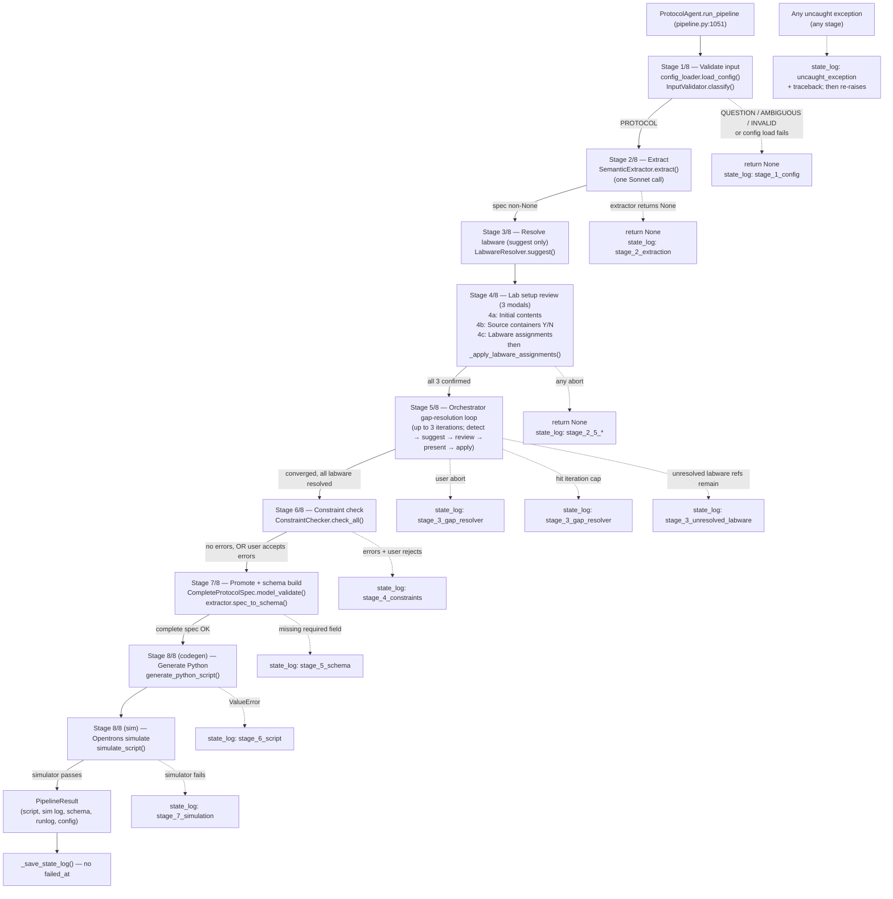
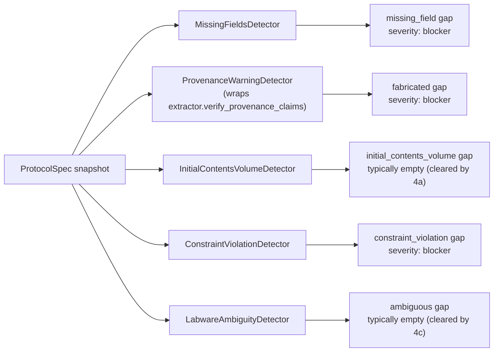

# nl2protocol — pipeline call graph (implementation-level)

Companion to `docs/PIPELINE.md`. The architecture doc describes *intent*; this doc traces *what the code actually does*, with file:line citations. Each stage has a "**drift from PIPELINE.md**" section calling out where doc and code disagree — either because the doc is stale, or because the code is buggy. Differences are flagged but not pre-judged.

**Three specific concerns** flagged during the 2026-05-16 deploy session are addressed at the bottom with verdicts and evidence.

---

## How to read this

**Diagrams use Mermaid** (renders on GitHub). Conventions:
- **Solid arrow** — always-taken edge.
- **Dashed arrow** — conditional; the condition is labeled.
- **Anchor names in backticks** (e.g. `{anchor: orchestrator-loop}`) — stable IDs for cross-doc reference. The future `ARCHITECTURE_TO_IMPL_MAP.md` and `IMPL_TO_VISUAL_MAP.md` docs will link in via these.

**File:line citations** are against the state of the `add-hosted-deploy` branch as of 2026-05-16. Line numbers shift; the *anchor* (function name, condition shape) is the stable reference.

**"UNCERTAIN" markers** mean static reading couldn't confirm — usually because of dynamic dispatch, registry lookups, or runtime-only conditions. These would resolve with a `sys.settrace` runtime pass.

---

## Top-level: full pipeline `{anchor: pipeline-top-level}`

The 9 stages from `PIPELINE.md` correspond to 8 *labeled* stages in code (`_emit_stage_started(N, ...)`). The mapping isn't 1-to-1 — see [Drift Pattern 1](#cross-cutting-drift) below. Diagram uses the code's labeling.



**Key reading notes:**
- Code labels stages 1–8; PIPELINE.md uses 9 stages (it splits codegen and simulate). The numbering mismatch is one of the cross-cutting drifts.
- "Stage 4" in code = three sub-modals (4a/4b/4c). The orchestrator does NOT run during this stage — it runs at code's Stage 5.
- The single `_save_state_log()` on the success path at line 1566 is what carries the per-run audit trail to disk. Failure paths use `_save_state_log("<marker>")` with a `failed_at` stamp.

---

## Stage-by-stage trace

For each stage: entry, calls, branches, events, state-log writes, drift from doc.

### Stage 1 — Validate input `{anchor: stage-1-validate}`

- **Entry:** `pipeline.py:1051` (`run_pipeline` start)
- **Calls (in order):**
  1. `self.config_loader.load_config()` (`pipeline.py:1056`)
  2. `InputValidator(api_key=...).classify(prompt)` (`pipeline.py:1070`)
- **Branches:**
  - Config-load exception → `_save_state_log("stage_1_config")`, return None.
  - `classify` returns non-PROTOCOL → log reason, return None (no state_log).
  - `classify` raises → log + return None.
- **Events emitted:** `stage_started`, `pipeline_progress("loading config")`, `pipeline_progress("classifying instruction (Haiku)")`.
- **State-log writes:** `state_log["input"]["config"]` on success (line 1057); failure marker only on config-load.
- **Drift from PIPELINE.md §1:** all claims match. Haiku-only, no config visibility ✓, halts on non-PROTOCOL ✓, cheap pre-Sonnet ✓.

### Stage 2 — Extract `{anchor: stage-2-extract}`

- **Entry:** `pipeline.py:1091`
- **Calls (in order):**
  1. `SemanticExtractor(client, model_name).extract(prompt, config)` (`pipeline.py:1100`)
  2. Emit `extracted_spec` event (`pipeline.py:1104`)
- **Branches:**
  - `spec is None` (LLM failure) → `_save_state_log("stage_2_extraction")`, return None. **The spec is lost** — no record of what the LLM returned (since it returned None).
- **Events emitted:** `stage_started`, `pipeline_progress`, `extracted_spec`.
- **State-log writes:** `state_log["stage_2_extraction"] = spec.model_dump()` on success only (line 1120). Failure path has no spec dump.
- **Drift from PIPELINE.md §2:** claims match. One Sonnet call ✓, claims-with-provenance ✓, nulls deferred ✓.
- **Minor gap:** the doc's §2e "deferred citation verification" is technically correct, but `extractor.verify_provenance_claims` IS called by the orchestrator's `ProvenanceWarningDetector` in Stage 5 — so it's deferred to a known location, not skipped.

### Stage 3 — Resolve labware (suggest only) `{anchor: stage-3-resolve}`

- **Entry:** `pipeline.py:1148`
- **Calls (in order):**
  1. Build suggester registry (`pipeline.py:1175-1184`)
  2. `LabwareResolver(...).suggest(spec)` (`pipeline.py:1193-1198`) — returns `dict[description → LabwareSuggestion]`, **does not mutate spec**.
- **Branches:** none (resolver is best-effort; nulls deferred to Stage 4c modal).
- **Events emitted:** none directly (the `labware_resolution_done` event fires later, after Stage 4c apply).
- **State-log writes:** none.
- **Drift from PIPELINE.md §3:** all claims match. Suggest-only pattern ✓, batched call ✓, deferred to 4c for apply ✓.

### Stage 4 — Lab setup review (three batch modals) `{anchor: stage-4-setup}`

- **Entry:** `pipeline.py:1217` (`_emit_stage_started(4, "Confirming with you")`)
- **Calls (in order):**
  1. `_confirm_initial_contents_via_handler(...)` (`pipeline.py:1223-1230`) — **4a**
  2. Source-container inference + Y/N (`pipeline.py:1236-1271`) — **4b**
  3. `_confirm_labware_assignments_via_handler(...)` (`pipeline.py:1278-1302`) — **4c**
  4. `self._apply_labware_assignments(spec, labware_suggestions, confirmed)` (`pipeline.py:1303`) — mutates spec
  5. Emit `labware_resolution_done` (`pipeline.py:1310`)
- **Branches:** any of the three modals may abort:
  - 4a abort → `_save_state_log("stage_2_5_initial_contents")`, return None.
  - 4b reject → `_save_state_log("stage_2_5_sources")`, return None.
  - 4c abort → `_save_state_log("stage_2_5_assignments")`, return None.
- **Events emitted:** `stage_started`, `pipeline_progress` x N, `labware_resolution_done`.
- **State-log writes:** **only on abort.** On success, **no record of what the user confirmed.** This is one of the audit gaps in Concern 3 below.
- **Drift from PIPELINE.md §4:** confirmations are reordered — they're labeled "Stage 4" in code but architectural §4 places them AFTER labware resolution (which here happens at Stage 3). Doc §4 also mentions a "unified lab-setup review surface" as the original intent that drifted; code still has three sequential modals.

### Stage 5 — Orchestrator gap-resolution loop `{anchor: stage-5-orchestrator}`

- **Entry:** `pipeline.py:1327` (Orchestrator construction); `orch.run(spec, context)` at `pipeline.py:1348`.
- **Detectors registered** (per `_emit_progress` at 1325, then construction): `MissingFieldsDetector`, `ProvenanceWarningDetector(extractor)`, `InitialContentsVolumeDetector`, `ConstraintViolationDetector`, `LabwareAmbiguityDetector`.
- **Suggesters registered (registry order):** `ConfigLookupSuggester`, `CarryoverSuggester`, `WellCapacitySuggester`, `RegexFromNoteSuggester`, `WellRangeClipSuggester`, `LabwareSuggester`, `LLMSpotSuggester`.
- **Reviewer:** `IndependentReviewSuggester` (Haiku) — invoked per suggestion when source ∈ {inferred, domain_default}.
- **Loop shape:** see `{anchor: orchestrator-loop}` diagram below.
- **Branches:**
  - `outcome.aborted` → `_save_state_log("stage_3_gap_resolver")`, return None (line 1366).
  - `not outcome.converged` (hit iter cap) → `_save_state_log("stage_3_gap_resolver")`, return None (line 1370).
  - Unresolved `LocationRef`s remain after orchestrator → `_save_state_log("stage_3_unresolved_labware")`, return None (line 1397).
- **Events emitted:** `stage_started`, `pipeline_progress`, `gap_iteration_*`, `gap_detected`, `gap_resolved`, `resolved_spec`.
- **State-log writes:** `state_log["stage_3_gap_resolver"]` is always populated after orchestrator returns (lines 1352-1363) — captures iterations + auto-accept stats. This is the **best-logged stage**.
- **Drift from PIPELINE.md §5:** loop sequence largely matches doc's "DETECT → topological sort → SUGGEST → REVIEW → CLASSIFY → PRESENT → APPLY → RE-DETECT", but the "CLASSIFY" step isn't a clearly separate function — it's the auto-accept gate test. **UNCERTAIN**: whether all 6 deterministic suggesters always fire in registry order, or whether some short-circuit on irrelevant gap kinds — agent flagged this for a runtime trace.

#### Orchestrator loop detail `{anchor: orchestrator-loop}`

```mermaid
sequenceDiagram
  participant P as Pipeline
  participant O as Orchestrator
  participant D as Detectors
  participant S as Suggesters (in registry order)
  participant R as Reviewer (Haiku)
  participant U as User (via Handler)

  P->>O: run(spec, context)
  loop up to 3 iterations
    O->>D: detect gaps
    D-->>O: gaps[]
    alt gaps == []
      O-->>P: converged
    end
    O->>O: topological sort (by field dependency)
    loop per gap
      O->>S: suggest (try each in order; first non-None wins)
      S-->>O: Suggestion | None
      opt suggestion AND source ∈ {inferred, domain_default}
        O->>R: review (two claims: positive_reasoning, why_not_in_instruction)
        R-->>O: confirms_positive, confirms_negative
      end
      alt auto-accept gate passes<br/>(suggestion exists AND<br/>kind ∉ {fabricated, ambiguous, constraint_violation} AND<br/>confidence ≥ 0.85 AND<br/>both review verdicts True)
        O->>O: apply Resolution
      else
        O->>U: present modal (per-Gap)
        U-->>O: accept | edit | override | skip | abort
        alt abort
          O-->>P: aborted
        end
        O->>O: apply Resolution
      end
    end
    O->>O: re-detect on mutated spec
  end
  O-->>P: hit cap (if still gaps remain)
```

#### Detectors fan-out `{anchor: detectors-fanout}`



### Stage 6 — Constraint check `{anchor: stage-6-constraints}`

- **Entry:** `pipeline.py:1400`
- **Calls (in order):**
  1. `ConstraintChecker(config).check_all(spec)` (`pipeline.py:1407-1408`)
  2. Populate state_log (always, even on success) (`pipeline.py:1410-1413`)
  3. Emit `constraint_check_done` (`pipeline.py:1420`)
- **Branches:**
  - Errors exist + user rejects → `_save_state_log("stage_4_constraints")`, return None (line 1462).
  - Errors exist + non-TTY + no handler → halt (line 1459).
- **Events emitted:** `stage_started`, `constraint_check_done`.
- **State-log writes:** `state_log["stage_4_constraints"]` ALWAYS populated (line 1410-1413). **Best-logged stage.**
- **Drift from PIPELINE.md §6:** all claims match. Deterministic checker ✓, prompt-on-errors ✓, default-no ✓. Duplication with orchestrator's `ConstraintViolationDetector` is acknowledged in doc.

### Stages 7-9 — Promote / codegen / simulate `{anchor: stages-7-9}`

- **Entry:** `pipeline.py:1474` (Stage 7), `pipeline.py:1506` (Stage 8), `pipeline.py:1537` (Stage 9).
- All three are deterministic (no LLM). Each writes a `_save_state_log("<stage>")` only on failure; the success path defers to the single end-of-run `_save_state_log()` at line 1566.
- **Stage 7** also writes `state_log["stage_5_spec"]` (the post-orchestrator spec dump) on the success path (line 1480) — so the final spec is auditable.
- **Stage 9** writes the script + simulation log to disk regardless of success/failure (debug script saved unconditionally at line 1535).
- **Drift from PIPELINE.md §7-9:** all claims match. No LLM ✓, deterministic ✓, simulator-is-final ✓, no retry ✓.

### Stage catch-all — uncaught exception `{anchor: stage-catchall}`

- **Entry:** `pipeline.py:1577-1593` (wraps the whole pipeline body).
- **What it does:** captures any uncaught exception, populates `state_log["exception_type"]`, `state_log["exception_message"]`, `state_log["traceback"]`, calls `_save_state_log("uncaught_exception")`, then **re-raises** so the caller still sees the crash.
- **Drift from PIPELINE.md:** doc doesn't mention this — it's defensive infrastructure (per `2c22a6e` commit message: "Bug B dumps the accumulated state_log when an uncaught exception escapes per-stage failure saves"). No drift; it's an addition.

---

## Three concerns — verified or refuted

These are the specific suspicions the user flagged during the 2026-05-16 deploy session. Each has a verdict + evidence.

### Concern 1 — Transfer well-set citations can be wrongly rejected as fabrication `{anchor: concern-1-wells-cites}`

**Verdict:** **PARTIALLY VERIFIED.** The infrastructure accepts multi-cite; the verifier's check shape can wrongly reject legitimate spread-cite cases.

**What the infrastructure does (correct):**
- `models/spec.py:132-148` — `Provenance._normalize_cited_text` validator accepts both a single string and a list of strings. Stored internally as a list.
- `extraction/prompts.py:84-103` — extractor prompt explicitly instructs the LLM to emit list-form cites for spread cases ("one entry per substring"), with example for wells captured from bullet-listed mappings.

**Where the wrongful rejection happens:**
- `extraction/extractor.py:336` — `check` function for each well in a wells list:
  ```python
  if not any(self._value_in_quote(value, q) for q in quotes):
  ```
- The verifier asks "is `value` (e.g. `"B2"`) a literal substring of ANY of the cite entries?" — across the full `cited_text` list.
- This works IF the well letter appears verbatim in at least one of the cites.
- **It fails** when the cite's phrasing doesn't name the well letter literally. Example: instruction says "Transfer Plasmid A to destination tube 1, then Plasmid B to destination tube 2." LLM extracts wells `[A1, B1]` with cited_text `["Transfer Plasmid A to destination tube 1", "Transfer Plasmid A to destination tube 1"]`. Verifier checks: "A1" in those cites? NO. → fabrication warning fires on a perfectly legitimate extraction.
- **Or:** cite uses different well naming (`"cells B1"` cited, but value is just `"B1"`) — works (substring match), unless the well-letter pattern doesn't appear.

**Mechanism summary:** the verifier was designed for atomic cites (one value, one cite). Spread cites are accepted structurally but not actually grounded per-element. The "any cite contains the value" check is the wrong shape for spread cites — what it should do is verify each value against AT LEAST one cite that *could plausibly* contain it.

**Recommended fix (later, not now):** rewrite the verifier so that for collection-valued fields with list-form cited_text, EACH value gets matched against an aligned subset of cites — either by index, or by allowing the LLM to emit a `cited_text` whose entries are explicitly mapped to value indices. This is a real schema/contract decision, not just a code patch.

### Concern 2 — Fabrication-gap "accept" is overdetermined `{anchor: concern-2-overdetermined}`

**Verdict:** **VERIFIED.** Code overwrites `confidence` when restating provenance, which `PIPELINE.md` §5 doesn't authorize.

**What the doc says (§5):**
> "For fabrication gaps specifically (where the value may already be correct but the citation is malformed), accept **restates** the field's provenance as `source="inferred"` with the suggester's reasoning — value untouched."

The doc enumerates what changes: source → "inferred", reasoning fields populated. **Value untouched.** Confidence: not mentioned.

**What the code does:**
- `gap_resolution/orchestrator.py:341-355` — when `resolution.action == "accept_suggestion" and gap.kind == "fabricated"`:
  ```python
  resolution = Resolution(
      action="accept_suggestion",
      new_value=Provenance(
          source="inferred",
          positive_reasoning=suggestion.positive_reasoning,
          why_not_in_instruction=suggestion.why_not_in_instruction,
          confidence=suggestion.confidence,        # ← overwrite
          review_status="user_accepted_suggestion",
      ),
      ...
  )
  ```
- The new `Provenance` carries `confidence=suggestion.confidence`. The original extractor's confidence is lost.
- `_apply_at_path` (line 826-838) then writes this new Provenance object to the field's provenance slot — replacing the whole object, including confidence.

**Why this is "overdetermined":** the user clicked Accept on a citation-fix. They expressed agreement with the suggester's *reasoning*, not necessarily endorsement of the suggester's *confidence calibration*. By overwriting confidence, the system claims the suggester's confidence is now the value's confidence, which is a stronger claim than the user actually made.

**Compounding issue:** there's no contract anywhere stating "confidence belongs to whoever last wrote the provenance." The implicit rule is "confidence = how confident we are in the value." When only the *citation* was wrong and the *value* is unchanged, the appropriate confidence is the original extractor's confidence in the value, not the suggester's confidence in their reasoning.

**Recommended fix (later):** on fabrication-gap accept, preserve the existing `confidence` and only update {source, positive_reasoning, why_not_in_instruction, review_status}. OR document explicitly that confidence is rewritten and why.

**Cross-cuts CodeRabbit's `types.py:208` finding** on Resolution: there's no `__post_init__` validating the (action, new_value, fields-touched) invariants. If there were, the over-rewrite of confidence would be a contract violation that surfaces at construction time.

### Concern 3 — State log only revealed in certain stages `{anchor: concern-3-state-log}`

**Verdict:** **REFUTED for the main claim, but identifies a real secondary gap.**

**Main claim refuted:** the state log IS written on both success and failure.
- **Success:** `_save_state_log()` is called at line 1566 with NO `failed_at` marker — captures the full per-stage state dictionary after a clean simulator pass.
- **Failure:** `_save_state_log("<stage_marker>")` fires at 12 different sites covering every per-stage failure plus an `uncaught_exception` catch-all (line 1590).

**Secondary gap (real):** interactive confirmations at Stage 4 are only logged on **abort**, never on success.
- 4a (IC) → `_save_state_log("stage_2_5_initial_contents")` only at line 1229 (abort path)
- 4b (sources) → only at line 1260 (abort path)
- 4c (assignments) → only at line 1288 (abort path)
- On success, the user's confirmed choices are NOT written to state_log. The downstream spec reflects them (via `_apply_labware_assignments`), but there's no audit-trail entry saying "user kept these defaults" or "user edited these volumes."

**Per-stage state_log coverage table:**

| Stage | Logs on success | Logs on failure | Always logs |
|---|---|---|---|
| 1 — Validate | partial (config dump) | yes (`stage_1_config`) | — |
| 2 — Extract | yes (spec dump) | yes (`stage_2_extraction`) | — |
| 4a/4b/4c — Confirmations | **NO** | yes (abort markers) | — |
| 5 — Orchestrator | yes (iteration stats) | yes | **YES** ✓ |
| 6 — Constraint check | yes (errors + warnings) | yes (`stage_4_constraints`) | **YES** ✓ |
| 7 — Promote | yes (final spec dump) | yes (`stage_5_schema`) | — |
| 8 — Codegen | — | yes (`stage_6_script`) | — |
| 9 — Simulate | yes (end-of-run dump) | yes (`stage_7_simulation`) | — |

**The asymmetry isn't random** — Stage 5 (orchestrator) and Stage 6 (constraints) are the load-bearing audit stages, and they DO log on every path. But the user's interactive choices at Stage 4 are an audit-trail hole.

**Recommended fix (later):** after each successful confirmation in 4a/4b/4c, write a `state_log["stage_2_5_<modal>_confirmed"] = {<what user kept vs edited>}` entry. Cheap addition, closes the audit gap.

---

## Cross-cutting drift (patterns spanning multiple stages)

### Drift 1 — Stage numbering mismatch
- Doc: 9 stages (1-9), splitting codegen and simulate.
- Code: 8 labels (`_emit_stage_started(N, ...)`), combining codegen + simulate at Stage 7/8.
- Code's "Stage 4" is the three-modal Lab Setup Review, which the doc places at §4a/4b/4c (under "Stage 4 — Pre-orchestrator batch confirmations").
- **Impact:** anyone tracing doc stage X to code stage X gets mis-aligned starting at Stage 3. Either re-label code stages to match doc, or update doc to call this out at the top.

### Drift 2 — Batch confirmations reordered pre-orchestrator
- Doc §336 acknowledges: "The code (post-Phase 3f) moved the batch confirmations and labware resolution BEFORE the orchestrator."
- This makes `InitialContentsVolumeDetector` and `LabwareAmbiguityDetector` mostly fire on already-cleared spec.
- **Impact:** doc §5 "Limitations" already calls this out as "detector overlap with stage 4."

### Drift 3 — State log asymmetry (see Concern 3)
- Interactive confirmation success paths don't log.
- Audit trail is incomplete for "what did the user choose."

### Drift 4 — Event-emission inconsistency
- Some stages emit start + progress + result events.
- Others emit only result, no progress.
- Batch confirmations emit progress but no per-modal result event (only the global `labware_resolution_done`).
- **Impact:** CodeRabbit already flagged `reporting.py:57` `EventKind` Literal missing 6 actually-emitted kinds — type-vs-wire drift.

### Drift 5 — Confidence semantics underspecified (see Concern 2)
- No contract states who owns `confidence` after a provenance restate.
- Fabrication-gap accept overwrites; doc doesn't authorize.

---

## Open questions

Things static reading couldn't resolve. A runtime trace (`sys.settrace` on a real pipeline run) would resolve most.

1. **Suggester registry order in practice.** Does every gap try all 7 suggesters until one returns non-None, or do some suggesters short-circuit by gap.kind? Static reading suggests "try in order"; a trace would confirm.

2. **Multi-cite verification empirical behavior.** Is the verifier wrongly rejecting spread-cite extractions in real protocols (Concern 1), or does the prompt warning effectively force the LLM into 1-to-1 cite-to-value mapping that always passes the substring check? Need test cases with known-good spread cites.

3. **LLMSpotSuggester confidence calibration.** When the suggester fires on a fabrication gap, what confidence does it return? If it's high (say 0.9), Concern 2's over-rewrite of confidence becomes a much bigger issue. If it's low, less so.

4. **Orchestrator "classify" step.** Doc describes "DETECT → … → CLASSIFY → PRESENT". Code has the auto-accept gate (which is implicitly the "classify" step) but no separate function. Is there hidden classification logic I missed?

5. **Confirmation success state logging.** Is the omission of confirmation-success state_log entries intentional (transient UI not deemed audit-worthy) or an oversight? No ADR found either way.

---

## How this doc supports future mapping

- **Every entity has a `{anchor: ...}` ID** — when `ARCHITECTURE_TO_IMPL_MAP.md` and `IMPL_TO_VISUAL_MAP.md` are written, they reference these anchors. No re-tracing needed.
- **Drift notes are per-stage** — the architecture map can lift drift-per-stage as its primary structure.
- **Events emitted are noted per stage** — the visual map can map each event kind to which column/modal/arrow it produces, with this doc as the source-of-truth for "which code emits this event."
- **Open questions are explicit** — the runtime-trace pass that resolves them is a known follow-up, not a hidden risk.
